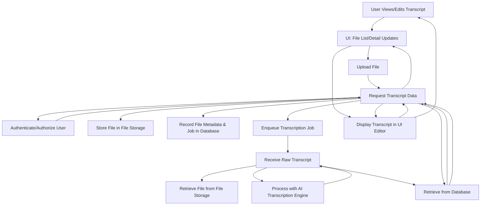
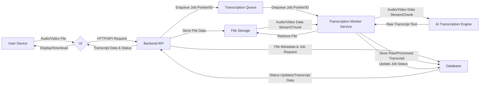
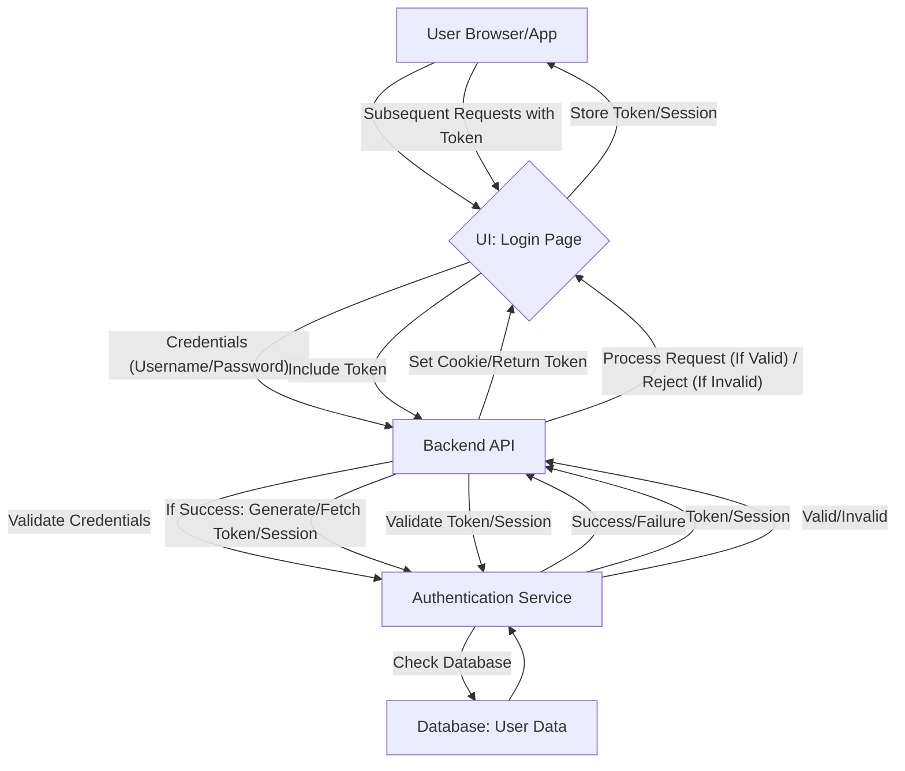

```markdown
# AI Transcription Service - MVP System Flow Documentation

## Version: 1.0
## Date: May 13, 2025

## 1. System Overview

This document outlines the core system flows for the Minimum Viable Product (MVP) of an AI-powered transcription service. The system is designed to reliably process audio and video files and provide users with editable text transcripts.

**Key Components:**

*   **User Interface (UI):** The web or mobile application frontend where users interact with the service (upload files, view transcripts, edit, export, manage account).
*   **Backend API (Gateway):** The central application logic layer. It handles user requests, interacts with databases, queues jobs, and communicates with other services.
*   **Authentication Service:** Manages user registration, login, and session management.
*   **File Storage:** Stores uploaded audio/video files securely (e.g., S3-compatible storage).
*   **Database:** Stores user information, file metadata, transcription jobs, and transcript text (e.g., PostgreSQL, MongoDB).
*   **Transcription Queue:** A message broker or queueing system (e.g., SQS, RabbitMQ) to manage transcription job requests.
*   **Transcription Worker Service:** Processes messages from the Transcription Queue. It retrieves files, interacts with the AI Transcription Engine, and updates the database.
*   **AI Transcription Engine:** The core AI model/service responsible for converting audio/video data into raw text. This could be an external service or an internal module.
*   **Export Service:** Handles the generation of transcripts in various formats (e.g., .txt, .srt) based on user requests.
*   **Billing/Freemium Component:** Tracks user usage against freemium limits and potentially interacts with payment gateways (for future premium tiers). For MVP, primarily tracks usage.

**High-Level Interaction Summary:**

Users interact with the UI, which communicates with the Backend API. The API uses the Authentication Service for user validation. Uploaded files are stored in File Storage, and metadata/jobs are recorded in the Database. Transcription requests are placed in a Queue, processed asynchronously by Worker Services interacting with the AI Engine. Results are stored in the Database and retrieved by the API for display/editing in the UI. The Export Service generates files on demand. The Billing/Freemium component informs the API about user limits.

## 2. User Workflows

This section details the primary journeys a user takes through the system.

**Core Transcription Workflow:**

This diagram illustrates the main path from file upload to viewing the completed transcript.



**Other Key User Journeys (Narrative):**

*   **Sign Up / Login:** User interacts with UI -> UI sends credentials to Backend API -> API sends to Authentication Service -> Auth Service validates -> API returns token/session to UI -> User accesses dashboard.
*   **View Files:** User interacts with UI -> UI requests file list from Backend API -> API queries Database for user's files -> Database returns metadata -> API sends data to UI -> UI displays file list.
*   **Edit Transcript:** User views transcript in UI Editor -> User makes changes -> UI sends updated transcript data to Backend API -> API updates Transcript Data in Database.
*   **Export Transcript:** User selects export option in UI -> UI requests export from Backend API (specifying format) -> API sends request to Export Service -> Export Service retrieves transcript from Database -> Export Service generates file -> Export Service returns file/link to API -> API provides download link to UI -> User downloads file.
*   **Track Usage (Freemium):** Backend API increments usage count (e.g., total transcribed minutes) in the Database/Billing component after each successful transcription -> UI can query API to display current usage to the user. API checks usage limits upon upload/transcription request.

## 3. Data Flows

This section illustrates the movement of data between key components, focusing on the transcription process data path.

**Transcription Data Path:**



**Other Key Data Flows (Narrative):**

*   **User Data:** User registration/login data flows from UI -> API -> Authentication Service -> Database (for user profile data).
*   **Edited Transcript Data:** UI sends edited text -> API -> Database (update transcript record).
*   **Export Data:** API requests Export Service -> Export Service retrieves transcript from Database -> Export Service generates file data -> Export Service returns file data/link to API -> API sends link/file data to UI -> UI facilitates download.
*   **Billing/Usage Data:** Transcription Worker Service sends usage metrics (e.g., duration) to Database/Billing Component -> API queries Database/Billing Component for user's current usage.

## 4. Error Handling

Effective error handling is crucial for a reliable MVP.

**General Strategy:**

*   **Graceful Degradation:** If a non-critical component fails, the core service should ideally remain partially operational (e.g., file list loads but transcription status is unknown).
*   **Informative User Messages:** Provide clear, user-friendly feedback when errors occur (e.g., "Upload failed: File too large," "Transcription failed, please try again later," "File format not supported").
*   **Logging and Monitoring:** Implement robust logging across all services to track errors, warnings, and critical events. Set up monitoring and alerting for key error rates or system health issues.
*   **Retry Mechanisms:** Implement automatic retries for transient errors (e.g., temporary network issues, database connection timeouts) in inter-service communication and job processing.
*   **Idempotency:** Design API endpoints and job processing to be idempotent where possible (e.g., retrying a job doesn't cause duplicate processing).
*   **Dead-Letter Queues (DLQ):** Failed transcription jobs that cannot be successfully retried should be moved to a DLQ for later analysis and potential manual reprocessing or error reporting.

**Specific Error Scenarios & Handling:**

*   **File Upload Failure:** UI displays error message (network issue, file size limit exceeded, invalid file type). API logs the error.
*   **Invalid File Format:** Backend API or Transcription Worker validates file format. If invalid, update file status in DB to 'Failed' with an error reason. UI displays error to user.
*   **Transcription Engine Failure:** Transcription Worker receives error from AI Engine. Worker updates job status in Database to 'Failed' with error details. Log the full error. UI displays 'Transcription Failed' status. Potentially trigger alert for operations.
*   **Database Errors:** API or Worker encounters DB error. Implement retries for transient errors. For persistent errors, log critical error and return appropriate API error (e.g., 500 Internal Server Error) or update job status to 'Failed' if writing job results.
*   **Queue Errors:** Failure to enqueue or dequeue messages. Monitoring on the queue system is essential. Worker services should handle queue connection issues with retries.
*   **Export Failure:** Export Service encounters an error (e.g., permission denied to storage, formatting error). Update export status in DB (if tracked) or return error response to API. API informs UI/user.
*   **Freemium Limit Exceeded:** API checks usage before accepting upload or starting transcription. If limit is reached, API returns specific error code/message. UI displays message informing user about the limit and potentially suggests upgrading (future).

## 5. Security Flows

Security is paramount, covering authentication, authorization, and data protection.

**Authentication Flow (Login Example):**



**Authorization Flow (Accessing a File Example):**

```mermaid
graph TD
    A[User] --> B{UI: View File Request};
    B -- Request File ID --> C[Backend API];
    C -- Receive Token --> C; % From Authentication Flow
    C -- Validate Token --> D[Authentication Service];
    D -- User ID --> C;
    C -- Check Authorization --> E[Database: File Metadata];
    E -- Query: Is User ID owner of File ID? --> C;
    C -- Yes/No --> C;
    C -- If Yes: Retrieve File/Transcript Data --> E;
    E -- Data --> C;
    C -- Return Data --> B;
    B -- Display File/Transcript --> A;
    C -- If No: Return Unauthorized (403) Error --> B;
```

**Key Security Measures:**

*   **Authentication:** Implement secure user authentication (e.g., using industry-standard protocols like OAuth 2.0 or OpenID Connect, or secure session management). Protect against brute force attacks.
*   **Authorization:** Enforce strict access control. Users should only be able to access, modify, or delete their *own* files and transcripts. The Backend API must verify ownership for every relevant request (e.g., view, edit, export, delete file/transcript). Role-based access (Freemium vs. Paid) should limit features or usage based on the user's plan.
*   **Data Encryption (In Transit):** All communication between the User Interface, Backend API, and other services must be encrypted using TLS/SSL.
*   **Data Encryption (At Rest):** Encrypt sensitive data stored in File Storage (audio/video files) and the Database (user information, transcript data).
*   **Secure Credential Management:** Do not store sensitive credentials in code or easily accessible configuration files. Use secure methods (e.g., environment variables, secrets management systems).
*   **Input Validation:** Sanitize and validate all user inputs to prevent injection attacks and other vulnerabilities.
*   **API Security:** Protect API endpoints with rate limiting and input validation.
*   **Secure Storage Configuration:** Configure File Storage and Database with appropriate access controls and permissions to prevent unauthorized access.

This MVP documentation provides a foundational understanding of the system's structure and flows. Future versions will detail more complex features, scaling strategies, and refined security measures.
```
